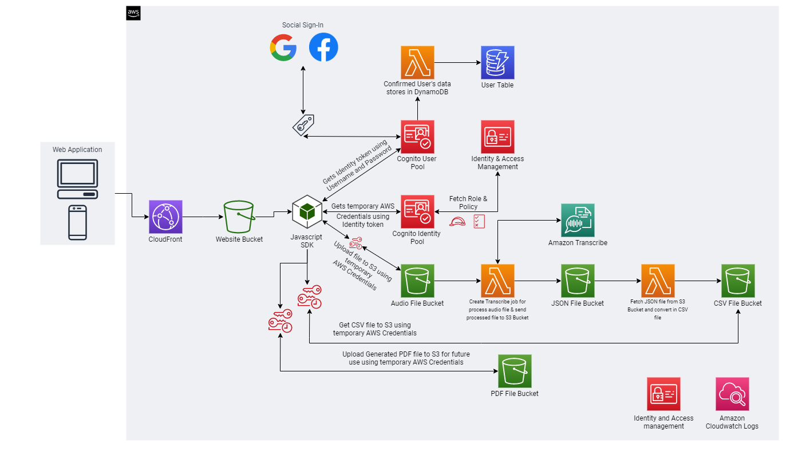

# Multi-speaker Transcription
Most people are living, working and learning on-the-go. With multiple deadlines, creative personal projects and more to juggle, it’s important to be efficient with your time and energy. Apps are one of the keys to mobility and efficiency in your work. If you haven’t tried using an app for text transcription, we recommend it. 

## Technology
- HTML, CSS, Bootstrap, JavaScript, JQuery, AWS, Python, Serverless Framework

## Architecture


- It's a fully serverless web application, built with AWS Serverless Technology.
- In the above architecture, used AWS services are Amazon CloudFront, Amazon S3 Bucket, Amazon Cognito, AWS Lambda, Amazon Transcribe, Identity and Access Management, Amazon CloudWatch.

## The solution contains the following steps:
- Website hosted on private `Amazon S3` bucket.
- Website only accessible via `Amazon CloudFront` using `Origin Access Identity` only.
- In order to access application user need to login via `Amazon Cognito user pool`, and will get IdToken.
- Once user got confirmation, one lambda function will run and it will store user data into thee `Amazon DyanmoDB`.
- Received IdToken will exchange to temporary AWS Access Key via `Amazon Cognito Identity Pool`.
- You upload the audio file to the `Amazon S3` Audio Bucket using `Temporary AWS Credentials`.
- The Amazon S3 PUT event triggers the `AWS Lambda function`.
- The function invokes an asynchronous Amazon Transcribe API call on the uploaded audio file.
- The transcription job runs and writes the output in JSON format to the target `S3 bucket`.
- Target `S3 Bucket` triggers PUT event and invoke `AWS Lambda function`.
- That invoked lambda function get JSON file and convert that file into the CSV file and upload to `S3 Bucket`.
- In website's Javascript code, continuously check for CSV file in every 1 minutes interval.
- Once the CSV file available in `S3 Bucket`, we will have CSV file content at website page using `AWS SDK for Javascript`.
- From the UI we download PDF file and that PDF file will upload to `S3 Bucket`.

## Demo
- Visit the link: https://d3o9h2o9kfficd.cloudfront.net
- For test audio file you can download from [here](https://github.com/ParthTrambadiya/multi-speaker-transcribe/raw/master/app/docs/medical-diarization.wav).
## Implementation
### Prerequisite
- Node
- Serverless Framework must be installed on your machine https://www.serverless.com/
- AWS CLI must be installed in your machine and credentials must be setup.

### Follow the below steps to deploy on the AWS Cloud
1. Clone this repo.
2. Install dependencies using `npm install`.
3. Change config file with this name `config.stage.json`. Stage will be your application stage e.g. `dev`, `test` or `prod`.
4. Write unique name of your `bucket` in config file. 
5. Write unique domain of your `cognito` in config file `Note: `Do not enter your entire domain for cognito domain, e.g. enter only `transvoice` instead of `transvoice.com`, because once you deployed stack you will get `https://your_cognito_domain.auth.region.amazoncognito.com` as cognito domain.

At the end run the below command.
```
serverless deploy --region <aws-region> --stage <stage>
```
Now, run the below command to deploy your website on S3 bucket.
```
npm run s3-sync s3://<bucket-name>
```

Suppose, you have done some changes in UI and you want to reflect those changes immediately on website then you need to first sync files with s3 by running the above command and invalidate cache in cloudfront using the below command.
```
npm run cf-invalidate <cloudfront-id>
``` 

To access website, CloudFront URL will be available in `stack-output.json` file in app `folder`.

### Follow the below steps to remove from the AWS Cloud
1. First, empty your all s3 buckets from console.
2. Go to the inside of your project folder on your machine.
```
serverless remove
```

